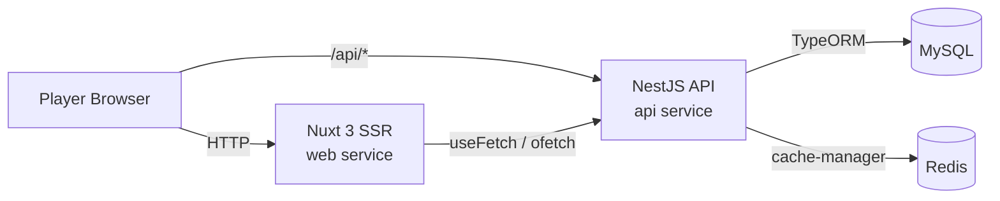
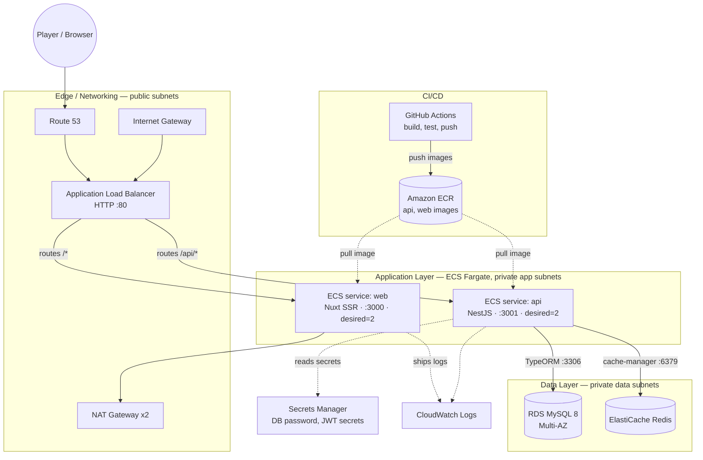

# Esports Tournament Organizer

A mini esports tournament platform: browse upcoming tournaments, drill into a tournament's
bracket/matches, and join as a player. Built with Nuxt 3 (frontend), NestJS (backend API),
MySQL (data) and Redis (caching).

## Tech stack

- **Frontend:** Nuxt 3, Vue 3, TypeScript, SCSS
- **Backend:** NestJS, TypeORM, class-validator, JWT auth (access + refresh tokens), Swagger
- **Database:** MySQL 8
- **Cache:** Redis (list/detail response caching)
- **Infra:** Docker Compose (local), Terraform on AWS ECS Fargate (production)

## Project structure

```
.
├── src/
│   ├── backend/     # NestJS API
│   └── frontend/    # Nuxt 3 web app
├── infra/
│   ├── terraform/   # AWS infrastructure (VPC, ECS Fargate, RDS, ElastiCache, ALB, ECR)
│   └── deploy.sh    # Build/push images to ECR + roll ECS services
├── docs/
│   └── architecture-aws.drawio   # Editable diagram (open at https://app.diagrams.net)
├── db-schema.sql    # MySQL DDL (tables, keys, FKs)
├── seed.sql         # Sample data (300 tournaments, 200+ players, sample matches)
└── docker-compose.yml
```

## Architecture

### Request flow (local & production are the same shape)



- `GET /api/v1/tournaments` and `GET /api/v1/tournaments/:id` are cached in Redis (60s TTL) since
  tournament listings/brackets don't change every request.
- `POST /api/v1/tournaments/:id/join` runs inside a DB transaction with a `pessimistic_write` lock
  on the tournament row, to avoid a race where two concurrent joins both pass the
  "is the tournament full" check.
- Auth is a simple JWT access/refresh pair (`POST /auth/login` upserts a player by email,
  `POST /auth/refresh` rotates the access token). It's intentionally minimal — see
  [Assumptions](#assumptions--trade-offs).

### AWS deployment topology

Editable source: [`docs/architecture-aws.drawio`](./docs/architecture-aws.drawio) (open in
[app.diagrams.net](https://app.diagrams.net)). Same architecture, GitHub-renderable version below:



## Running locally

Requirements: Docker + Docker Compose.

```bash
cp .env.example .env
docker compose up --build
```

This starts 4 containers:

| Service | URL | Notes |
| --- | --- | --- |
| `web` | http://localhost:3000 | Nuxt frontend |
| `api` | http://localhost:3001/api/v1 | NestJS API, Swagger at `/api/v1/docs` |
| `db` | localhost:3307 → container 3306 | MySQL, seeded automatically on first boot |
| `redis` | localhost:6380 → container 6379 | Cache |

> Host ports for `db`/`redis` are remapped (3307/6380) to avoid clashing with any MySQL/Redis
> already running on your machine; the containers still talk to each other on 3306/6379
> internally.

MySQL's `docker-entrypoint-initdb.d` runs `db-schema.sql` (DDL) before `seed.sql` (data) on the
**first** container start only — the schema was split out because the original `seed.sql` only
contained `INSERT`s and assumed tables already existed. To re-seed from scratch:

```bash
docker compose down -v   # drops the db_data volume
docker compose up --build
```

### Running backend/frontend without Docker

```bash
# backend
cd src/backend
cp .env.example .env   # point DB_HOST/REDIS_HOST at localhost if running DB/Redis via `docker compose up db redis`
npm install
npm run start:dev

# frontend
cd src/frontend
npm install
npm run dev
```

## API

Base path: `/api/v1`. Full interactive docs at `/api/v1/docs` (Swagger) once the API is running.

| Method | Path | Auth | Description |
| --- | --- | --- | --- |
| GET | `/tournaments` | – | List tournaments (`search`, `status`, `page`, `pageSize`) |
| GET | `/tournaments/:id` | – | Tournament details + matches + participants |
| POST | `/tournaments` | Bearer | Create a tournament |
| POST | `/tournaments/:id/join` | Bearer | Join a tournament (`playerId`) |
| POST | `/auth/login` | – | Upsert player by email, returns access + refresh tokens |
| POST | `/auth/refresh` | – | Exchange a refresh token for a new access token |

## Database

See [`db-schema.sql`](./db-schema.sql) for full DDL. Core tables:

- `tournaments` — name, start_time, max_players, status (`scheduled`/`ongoing`/`completed`)
- `players` — username, unique email
- `tournament_players` — join table (composite PK), one row per player per tournament
- `matches` — bracket rounds, `player1_id`/`player2_id`/`winner_id` (nullable, `SET NULL` on
  player delete), `tournament_id` (`CASCADE` on tournament delete)

Example queries used by the API (see `src/backend/src/modules/tournaments/services/tournaments.service.ts`):

```sql
-- Tournament list with live participant counts
SELECT t.*, COUNT(DISTINCT tp.player_id) AS participantCount
FROM tournaments t
LEFT JOIN tournament_players tp ON tp.tournament_id = t.id
GROUP BY t.id
ORDER BY t.start_time ASC
LIMIT :pageSize OFFSET :offset;

-- Join, with a row lock so two concurrent requests can't both succeed once the tournament is full
SELECT * FROM tournaments WHERE id = :id FOR UPDATE;
```

## Scaling & security considerations

- **Scaling:** `api` and `web` are stateless (auth is JWT, no server-side sessions) so they scale
  horizontally — the Terraform config runs 2 tasks of each behind the ALB and they can be scaled
  further via `desired_count` or an ECS Application Auto Scaling policy on CPU/RequestCount.
  Redis absorbs read load on the hot `list`/`details` endpoints; RDS can be scaled vertically or
  read replicas added if reads outgrow a single primary.
- **Security:** input validation via `class-validator` DTOs with `whitelist`/`forbidNonWhitelisted`
  (rejects unexpected fields), rate limiting via `@nestjs/throttler`, JWT bearer auth on
  write endpoints, secrets (DB password, JWT signing keys) kept in AWS Secrets Manager and
  injected into ECS tasks rather than baked into images, RDS/Redis only reachable from the ECS
  security group (no public ingress).
- **Efficiency:** list/detail responses cached in Redis; DB indexes on `tournaments.name`,
  `matches.tournament_id`, `tournament_players.tournament_id`/`player_id`.

## Deploying to AWS

Infrastructure is defined in [`infra/terraform`](./infra/terraform) (VPC, ECS Fargate cluster,
ALB, ECR, RDS MySQL, ElastiCache Redis, Secrets Manager, CloudWatch Logs).

```bash
cd infra/terraform
cp terraform.tfvars.example terraform.tfvars   # fill in real secrets
terraform init
terraform apply
```

Then build and push the two images and roll the ECS services (run from the repo root, requires
the AWS CLI configured and the resources above already applied once):

```bash
./infra/deploy.sh
```

`terraform apply` prints `alb_dns_name` — that's the public URL once the ECS services pass their
health checks. Point a Route 53 record at it (or use it directly) for a stable URL.

## Assumptions & trade-offs

- Auth is intentionally minimal: `POST /auth/login` upserts a player by email (no password) and
  hands back a JWT pair. A production version would add a real credential/OAuth flow.
- `seed.sql`'s `WITH RECURSIVE` tournament generator and its player-generation query didn't
  actually run as shipped (`WITH RECURSIVE` was placed before `INSERT INTO` instead of inside the
  `SELECT`, and the player query cross-joined without a formula that produces distinct usernames,
  causing duplicate-email errors) — both were fixed in place; behavior/row counts are unchanged.
- Cache invalidation on write (`create`/`join`) does a full `cache.reset()` rather than targeted
  key deletion — simple and correct, but not the most efficient at very high write volume; a
  future iteration would tag/delete only the affected tournament's cache keys.
